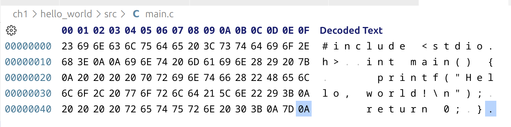
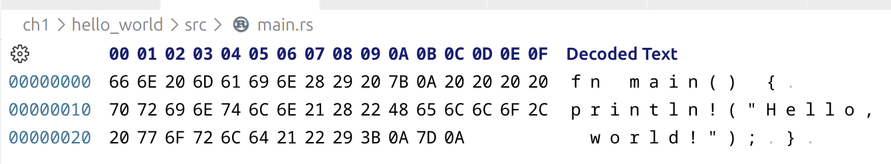

# Chapter 1: A Tour of Computer Systems

This chapter serves as an overview of the book and has very little code. However
they do start off with a simple [`hello_world`](hello_world/src) example they
use to investigate how a computer works to both compile and then execute the
program.

## 1.1 Information is Bits + Context

Everything the computer works with is just bits being interpretted in different
ways. Starts off with a basic example of the ASCII bytes stored for the source
text file for a hello world program. Here are examples of the ASCII bytes for
the C & Rust hello world source code text files:

### Aside: Origins of the C programming language

Describes the origins of C, created by Denis Ritchie at Bell Labs. References
the K&R classic
[book](https://www.amazon.com/Programming-Language-2nd-Brian-Kernighan/dp/0131103628)
introducing C. A more recent book that includes coverage of the latest C11
standard is
[Effective C](https://www.amazon.com/Effective-Introduction-Professional-Robert-Seacord/dp/1718501048).

The wikipedia page on C has a more in-depth discussion of the
[history](https://en.wikipedia.org/wiki/C_(programming_language)#History) of the
language.

## 1.2 Programs are Translaged by Other Programs into Different Forms

A brief description of how a compiler takes the text source code and turns it
into program that can be executed by the computer. It describes four main steps:

- Preprocessing (`hello.c` => `hello.i`)
- Compilation (`hello.i` => `hello.s`)
- Assembly (`hello.s` => `hello.o`)
- Linking (`hello.o` => `hello`)

### Aside: The GNU project

 Describes the [GNU](https://www.gnu.org/home.en.html) project, started by
 Richard Stallman, and a number of open source tools it created
 (EMACS, GCC, GDB). Distinguishes these tools from Linux as the OS and finally
 identifies GNU as essential to the creation of the *free software* movement.
 [Here](https://cs.stanford.edu/people/eroberts/cs181/projects/2000-01/open-source/gnu.htm)
 is an article with more details on GNU.

## 1.3 It Pays to Understand How Compilation Systems Work

A breakdown on why understanding compilatoin is important for programming is
provided in three main points:

1. **Optimization**: Understanding how machine code is generated from a
programming language will help inform how you can write code that performs
better.
2. **Errors**: Compilation errors, specifically linking, can be complex and
hard to debug without an understanding of what the compiler is doing.
3. **Security**: Knowing how the machine is processing data with your code will
help avoid common security issues.